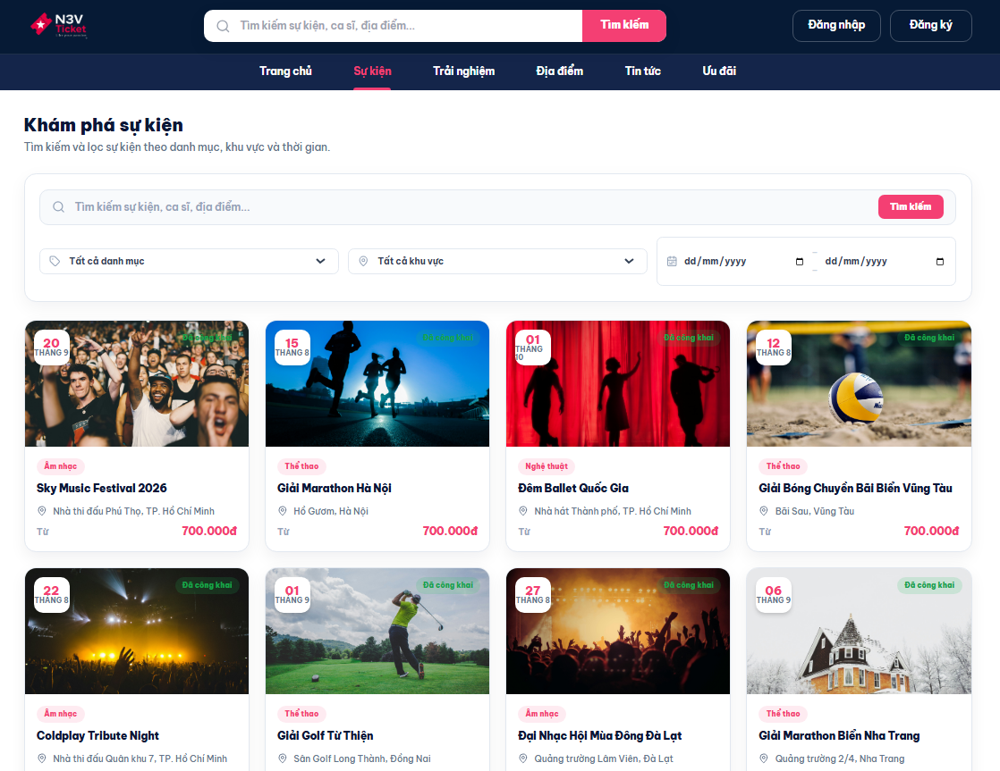
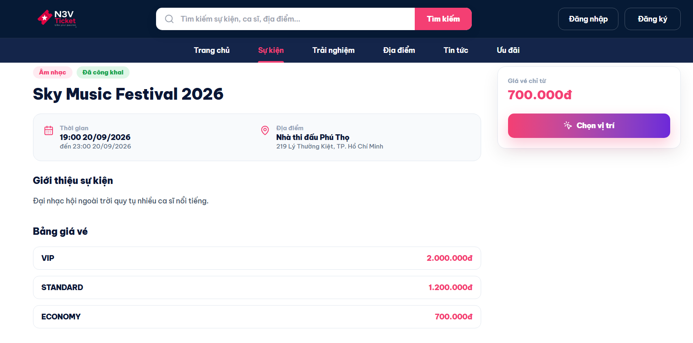
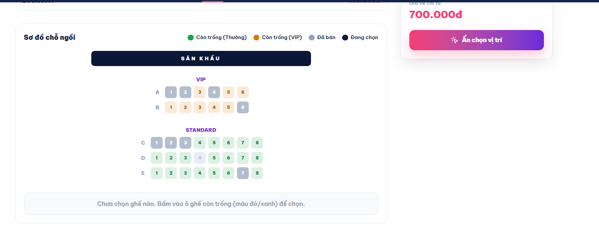
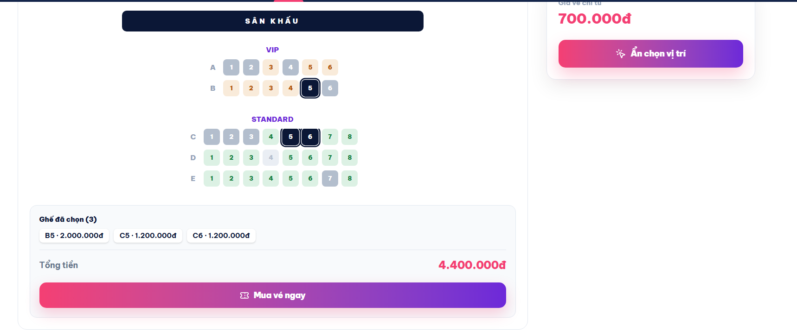
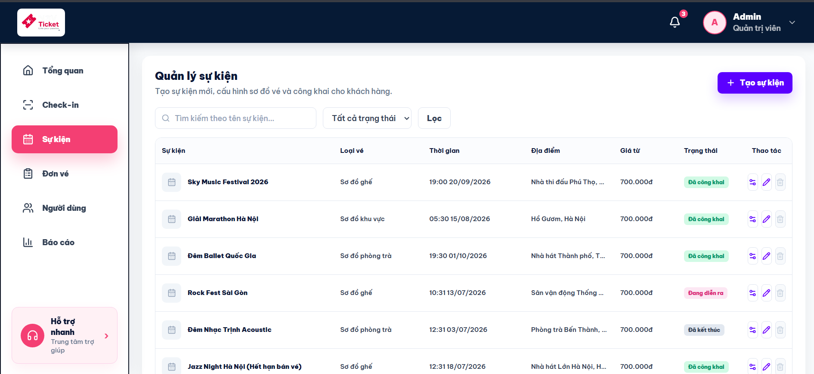
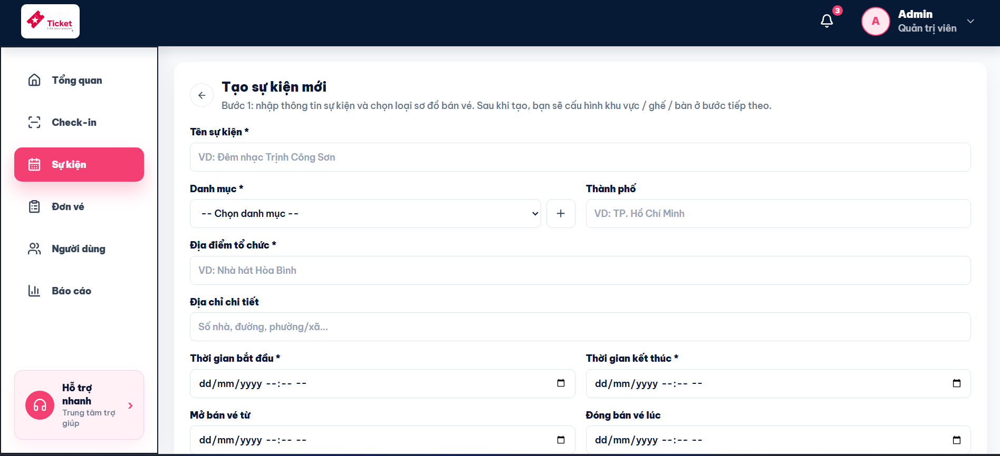
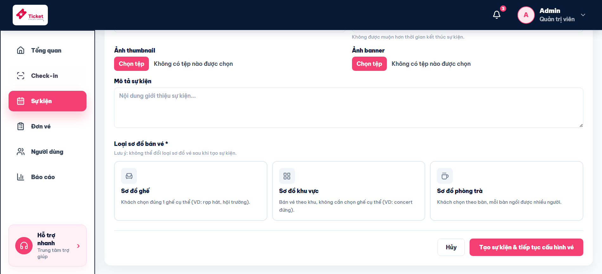
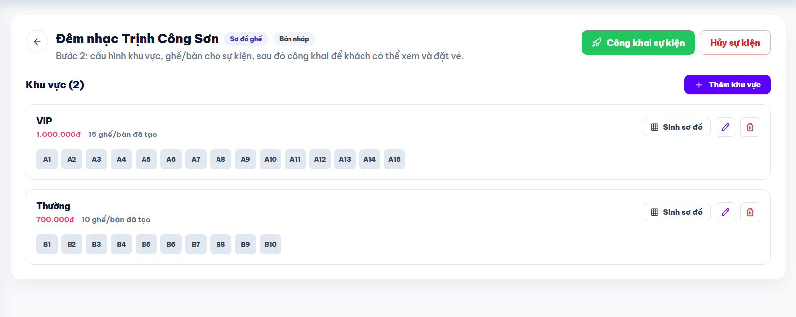

# N3V Ticket - Nền tảng bán vé sự kiện trực tuyến
Hệ thống bán vé sự kiện trực tuyến fullstack, hỗ trợ nhiều loại sơ đồ bố trí chỗ ngồi (sơ đồ ghế, khu vực, phòng trà), quản trị sự kiện, đặt vé và thanh toán. Dự án đồ án nhóm 4 người, xây dựng theo mô hình client–server tách biệt Backend (Spring Boot) và Frontend (React/TypeScript).

## 📌 Giới thiệu
N3V Ticket mô phỏng một nền tảng bán vé thực tế (kiểu Ticketbox/Eventbrite), cho phép:

- Ban quản trị tạo, quản lý sự kiện, danh mục, khu vực chỗ ngồi.
- Người dùng tìm kiếm, lọc sự kiện, chọn chỗ ngồi trực quan trên sơ đồ, đặt vé và thanh toán.
- Hệ thống xác thực, phân quyền và quản lý đơn hàng theo thời gian thực.

## 🔗 Demo
**Link:** https://n3v-ticket.vercel.app/

**Tài khoản Admin:**
- Email: `admin@n3v.com`
- Password: `Admin@123`

> ⚠️ **Lưu ý:** Dự án đang deploy trên gói miễn phí (free tier), nên server backend có thể "ngủ" sau thời gian không hoạt động. Lần truy cập đầu tiên hoặc khi tải danh sách sự kiện có thể mất khoảng 30-60 giây để khởi động lại - vui lòng chờ một chút thay vì reload liên tục.

## 🖼️ Screenshots

### Trang người dùng — Khám phá & đặt vé sự kiện

**Danh sách & tìm kiếm sự kiện**


**Trang chi tiết sự kiện — thông tin & bảng giá vé**


**Sơ đồ chọn chỗ ngồi trực quan (VIP / Standard)**


**Chọn ghế & xem tổng tiền theo thời gian thực**


### Trang quản trị (Admin) — Quản lý sự kiện

**Danh sách sự kiện & trạng thái (Bản nháp / Đã công khai / Đang diễn ra / Đã kết thúc)**


**Tạo sự kiện mới — nhập thông tin cơ bản**


**Chọn loại sơ đồ bán vé (Ghế / Khu vực / Phòng trà)**


**Cấu hình khu vực & bulk generate ghế theo hàng**


## 👤 Vai trò của tôi - Lê Phạm Thanh Nguyệt
Phụ trách module **Event Management (Quản lý & Hiển thị sự kiện)** - module lõi cung cấp dữ liệu và luồng hiển thị sự kiện cho toàn bộ hệ thống, từ phía admin lẫn phía người dùng cuối.

**Thiết kế & xây dựng:**
- Thiết kế schema database: `Category`, `Event`, `EventZone`, `EventSeat`, quản lý migration bằng Flyway.
- Xây dựng cơ chế hỗ trợ **3 loại sơ đồ bố trí vé** khác nhau trong cùng một hệ thống: Seat Map (chọn ghế cụ thể), Zone (bán theo khu vực), Tea Lounge (bán theo bàn) - cho phép admin chọn loại phù hợp khi tạo sự kiện, và loại sơ đồ không thể thay đổi sau khi tạo để đảm bảo tính toàn vẹn dữ liệu.
- Xây dựng tính năng **bulk seat generation**: tự động sinh hàng loạt ghế theo cấu hình khu vực (số hàng, số ghế/ hàng), giảm thao tác nhập liệu thủ công cho admin.
- Thiết kế **state machine** quản lý vòng đời sự kiện: `DRAFT → PUBLISHED → ONGOING → COMPLETED / CANCELLED`, đảm bảo sự kiện chỉ hiển thị công khai và cho phép đặt vé khi ở đúng trạng thái.
- Xây dựng **bộ lọc sự kiện đa tiêu chí** (danh mục, khu vực, khoảng thời gian, từ khóa) bằng JPA Specification, hỗ trợ tìm kiếm động không cần viết lại query cho từng tổ hợp filter.
- Phát triển giao diện quản trị CRUD sự kiện (tạo/ sửa/ xóa/ công khai), upload ảnh thumbnail & banner, và giao diện cấu hình sơ đồ ghế trực quan cho admin.
- Xử lý phân quyền & bảo mật: kiểm soát endpoint theo vai trò (admin vs. người dùng), xác thực request bằng JWT.

**Kết quả:** Module hoạt động ổn định, được các module khác trong nhóm (Booking/Payment, Dashboard) sử dụng làm nguồn dữ liệu sự kiện chính; xử lý được cả 3 luồng bán vé khác nhau trên cùng một codebase mà không phải viết logic riêng lẻ cho từng loại.

## ⚙️ Công nghệ sử dụng
**Backend**
- Java 21, Spring Boot (Web, Data JPA, Security)
- PostgreSQL (Supabase) - quản lý schema bằng Flyway Migration
- JWT Authentication, Spring Security
- JPA Specification (lọc động), Hibernate Validation

**Frontend**
- React + TypeScript
- Tích hợp API thực (đã thay thế toàn bộ mock data)

## 🧩 Kiến trúc & Module chính
Dự án được chia thành các module do từng thành viên phụ trách:

| Module | Mô tả | Phụ trách |
|---|---|---|
| Auth | Đăng ký, đăng nhập, phân quyền, JWT | Vũ |
| Event Management | Quản lý & hiển thị sự kiện | Lê Phạm Thanh Nguyệt |
| Booking/Payment | Đặt vé, xử lý thanh toán | Nhung |
| Dashboard/Reports | Thống kê, báo cáo quản trị | Nguyên |

## 🚀 Cài đặt & chạy dự án

### Yêu cầu
- Java 21+, Maven (dùng kèm mvnw)
- Node.js 18+ (cho frontend)
- PostgreSQL (local hoặc Supabase)

### 1. Clone dự án
```bash
git clone https://github.com/<your-username>/fullstack-n3v-ticket-web-project.git
cd fullstack-n3v-ticket-web-project
```

### 2. Cấu hình Backend
Mở `backend/src/main/resources/application-local.properties` và cập nhật:
```properties
spring.datasource.url=jdbc:postgresql://localhost:5432/n3vticket
spring.datasource.username=postgres
spring.datasource.password=your_password
jwt.secret=your_jwt_secret_min_32_chars
```

Nếu dùng Supabase, lấy JDBC connection string tại Project Settings → Database:
```properties
spring.datasource.url=jdbc:postgresql://<host>.pooler.supabase.com:6543/postgres?sslmode=require
spring.datasource.username=postgres.xxxxxxxxxxxxxxxxxxxx
spring.datasource.password=your_database_password
```

Chạy backend:
```bash
cd backend
./mvnw spring-boot:run        # macOS/Linux
.\mvnw.cmd spring-boot:run     # Windows PowerShell
```

Nếu database báo thiếu bảng/cột (`roles`, `role_id`, ...), chạy file `backend/fix_auth_schema.sql` trong Supabase SQL Editor hoặc DBeaver.

### 3. Chạy Frontend
```bash
cd frontend
npm install
npm run dev
```

## 🔑 API mẫu

**Đăng ký**
```http
POST /api/auth/register
Content-Type: application/json

{
  "fullName": "Admin Test",
  "email": "admin@test.com",
  "phone": "0900000001",
  "password": "Admin@123"
}
```

**Đăng nhập**
```http
POST /api/auth/login
Content-Type: application/json

{
  "email": "admin@test.com",
  "password": "Admin@123"
}
```

**Lấy thông tin cá nhân**
```http
GET /api/users/profile
Authorization: Bearer <accessToken>
```

**Danh sách sự kiện (module Event Management)**
```http
GET /api/events?categoryId=1&status=PUBLISHED&keyword=concert
```

## 📄 Giấy phép
Dự án phục vụ mục đích học tập, thực hiện trong khuôn khổ đồ án môn học.
